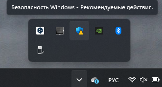
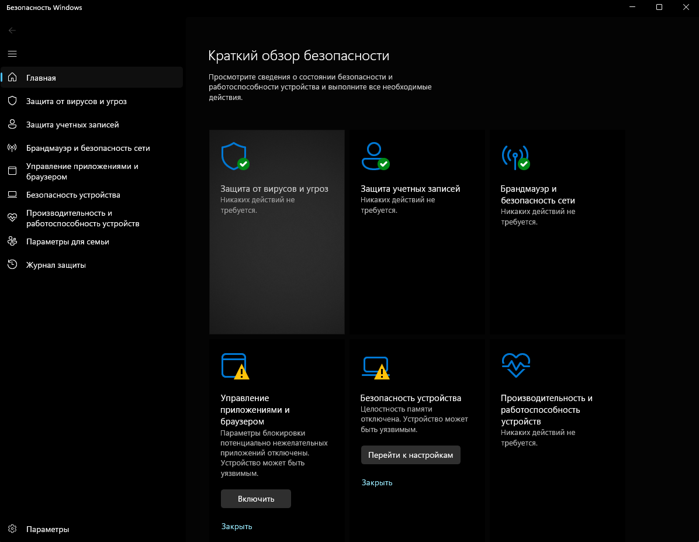
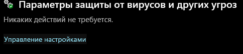
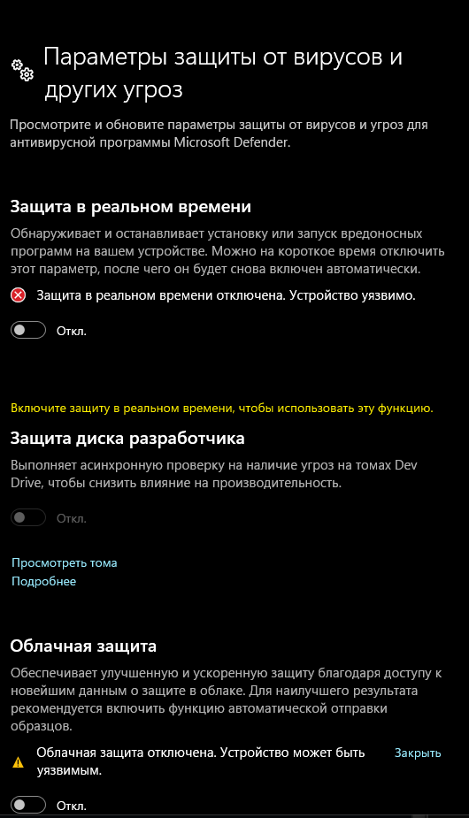
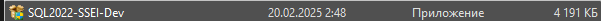
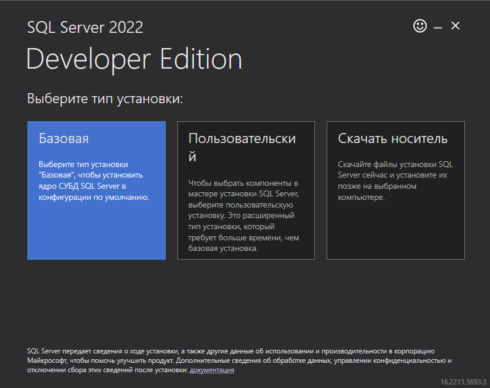
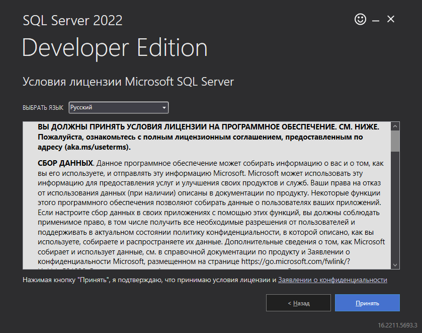
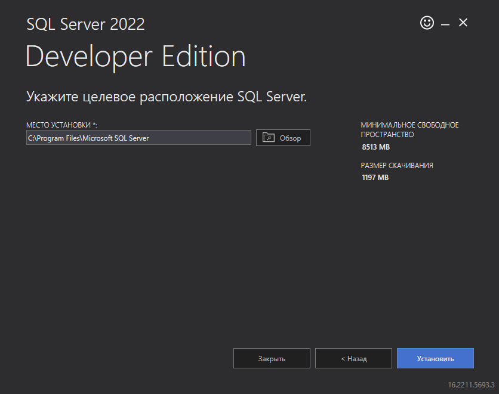
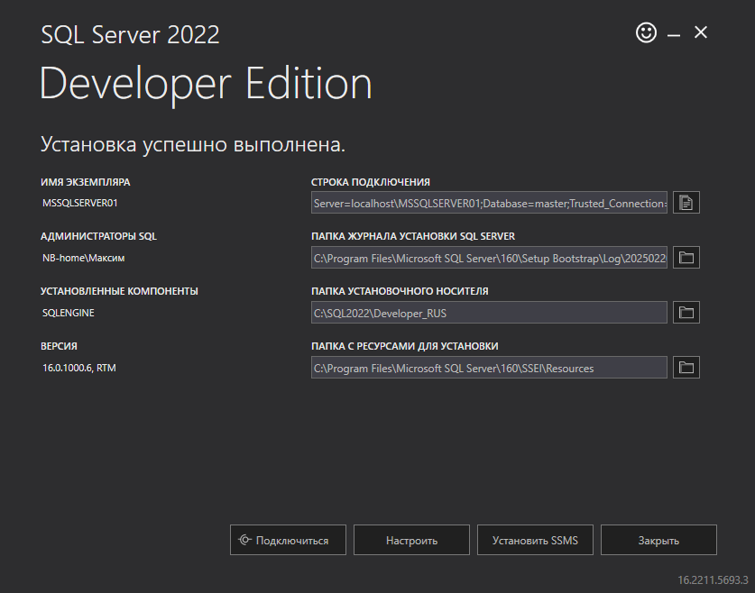

<h1>Инструкция по копированию базы данных с ssms для студентов КИУ</h1>
<h3>!!!Перед началом выполнения инструкции необходимо отключить антивирус на вашем ПК</h3>

Отключение антивируса

Нажимаем на значок антивируса

Переходим в раздел "Защита от вирусов и угроз"

Переходим в управление настройками

Переключаем все ползунки

Готово

<h2>1 часть. Установка sql server и ssms</h2>

Установка sql server: <a href="https://github.com/MaksimFomin06/instructions-for-copying-a-database-from-SSMS/raw/refs/heads/main/sql%20server/SQL2022-SSEI-Dev.exe?download=" download>SQL Server </a>

Инструкция по запуску

<ul>
<li>
Запускаем файл

</li>
<li>
В всплывающем окне разрешаем внесение изменений на устройстве("Да")
</li>
<li>
Выбираем тип установки "Базовая"

</li>
<li>
Нажимаем "Принять"

</li>
<li>
Проверяем место установки и нажимаем кнопку "Установить"

</li>
<li>
Ждем конца установки. Размер ~8.5gb
Нажимаем "Закрыть" и "Да"

</li>
</ul>

Скачать ssms: <a href="https://github.com/MaksimFomin06/instructions-for-copying-a-database-from-SSMS/raw/refs/heads/main/ssms/SSMS-Setup-RUS.exe?download=" download>SSMS-Setup-RUS.exe ~695mb</a>

Инструкция по запуску

