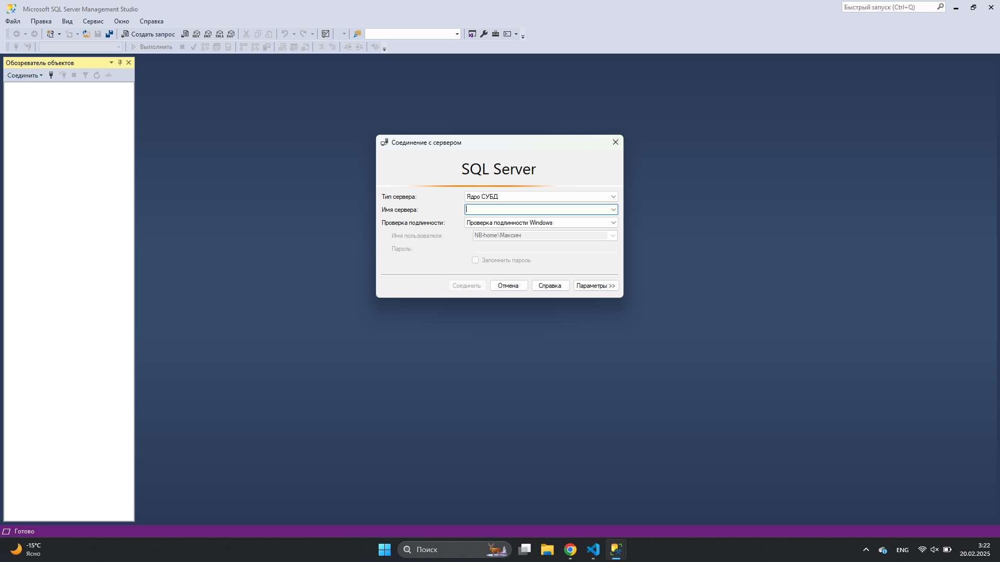
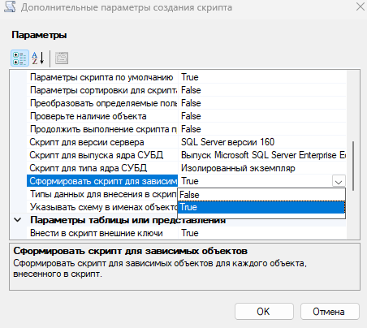
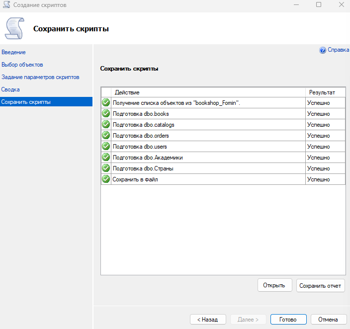
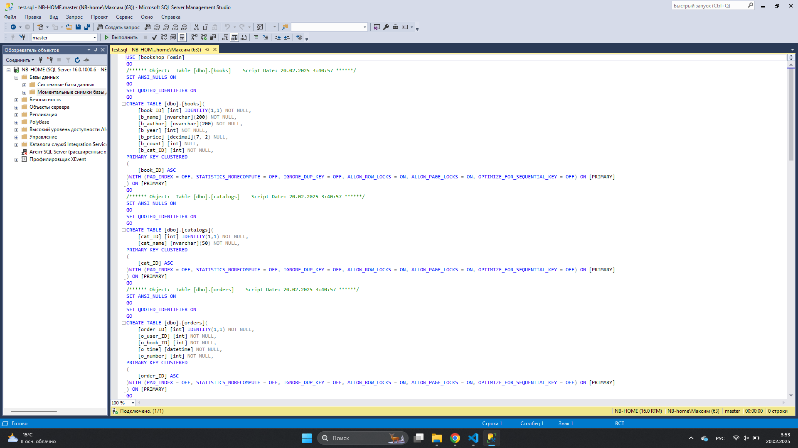

<h1>Инструкция по копированию базы данных с ssms для студентов КИУ</h1>
<h3>!!!Перед началом выполнения инструкции необходимо отключить антивирус на вашем ПК</h3>

Отключение антивируса (раскрывается)

Нажимаем на значок антивируса

Переходим в раздел "Защита от вирусов и угроз"

Переходим в управление настройками

Переключаем все ползунки

Готово

<h2>1 часть. Установка sql server и ssms</h2>

<h3>Установка sql server:</h3> <a href="https://github.com/MaksimFomin06/instructions-for-copying-a-database-from-SSMS/raw/refs/heads/main/sql%20server/SQL2022-SSEI-Dev.exe?download=" download>SQL Server </a>

Инструкция по запуску (раскрывается)

<ul>
<li>
Запускаем файл

</li>
<li>
В всплывающем окне разрешаем внесение изменений на устройстве("Да")
</li>
<li>
Выбираем тип установки "Базовая"

</li>
<li>
Нажимаем "Принять"

</li>
<li>
Проверяем место установки и нажимаем кнопку "Установить"

</li>
<li>
Ждем конца установки. Размер ~8.5gb.
Нажимаем "Закрыть" и "Да"

</li>
</ul>

<h3>Скачать ssms:</h3> <a href="https://github.com/MaksimFomin06/instructions-for-copying-a-database-from-SSMS/raw/refs/heads/main/ssms/SSMS-Setup-RUS.exe?download=" download>SSMS-Setup-RUS.exe ~695mb</a>

Инструкция по запуску (раскрывается)

<ul>
<li>
Запускаем файл

</li>
<li>
В всплывающем окне разрешаем внесение изменений на устройстве("Да")
</li>
<li>
Проверяем расположение и кнопку "Установить".
После установки нажимаем "Закрыть"

</li>
</ul>

<h2>2 часть. Настройка ssms</h2>

Настройка (раскрывается)

<ul>
<li>
Открываем ssms. Нас встречает такое меню.

</li>
<li>
Далее в окне выбираем "Продолжить обзор"

</li>
<li>
Выбираем как на фото. Далее "ОК" и "Соединить"

</li>
</ul>

<h2>3 часть. Копирование БД с сервера</h2>

Копирование бд (раскрывается)

<ul>
<li>
Правой кнопкой мыши нажимаем на нужную БД

</li>
<li>
Нажимаем "Задачи" -> "Сформировать скрипты"

</li>
<li>
Выйдет такое меню

</li>
<li>
Нажимаем "Далее"
</li>
<li>
Выбираем как на фото, затем "Далее"

</li>
<li>
Нажимаем дополнительно. "Сформировать скрипт для зависимостей -> True"
  
</li>
<li>
Далее выбираем параметры сохранения и обязательно запоминаем путь сохранения и название файла. Нажимаем "Далее" два раза

</li>
<li>
Итоговый результат. Нажимаем "Готово"

</li>
</ul>

<h2>4 часть. Копирование бд в ssms</h2>

Инструкция по копированию

<ul>
<li>
В ssms создаем базу данных с таким же названием как и на сервере

</li>
<li>
Выйдет окно. В "Имя базы данных" пишем название БД. Нажимаем "ОК"

</li>
<li>
Находим наш файл в проводнике, нажимаем на него два раза

</li>
<li>
Файл откроется в ssms и нам нужно будет его выполнить

</li>
<li>
Если вы все сделали правильно то скрипт выполнится успешно

</li>
<li>
Можем проверить правильность копирования выводом случайных данных из БД

</li>
</ul>

